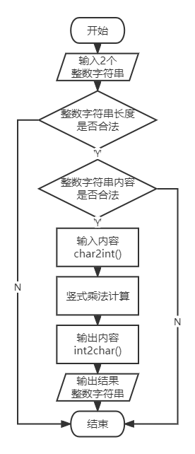
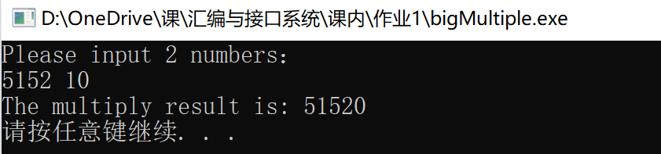
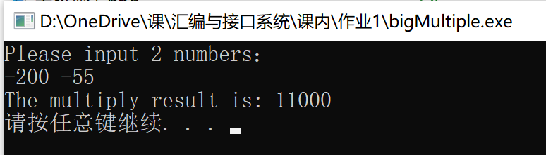
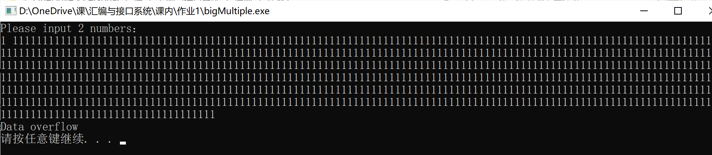
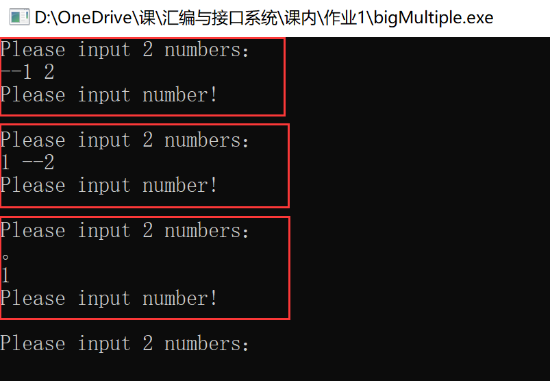
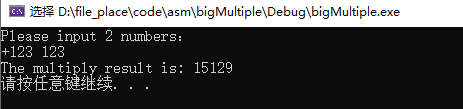

## Multiply Strings_asm

#### 实验内容

使用X86汇编语言，实现大数相乘，要求两个十进制大整数的相乘（100位以上），输出乘法运算的结果。

#### 设计思路及流程图

设计汇编语言之前，首先构思C语言的程序设计。C语言的数据类型，比如long long,double等，都有大小限制，因此当整数乘法结果可能无法存下而导致溢出。由此，根据高精度乘法，输入存在字符串中，转换为整数数组存储整数的每一位，通过程序模拟竖式乘法的计算，将计算结果同样存储在数组中，最后转换成字符串打印输出。

#### 实验结果

1. **正常正数整数乘法**

   

2. **正常存在负数的整数乘法**

   

3. **其中一个整数输入长度超过150**

   

4. **其中一个整数输入不合法**

   

5. **带’+’符号的输入**

   